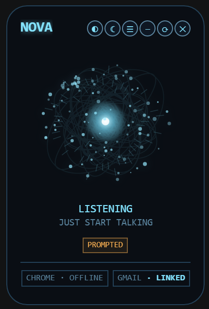
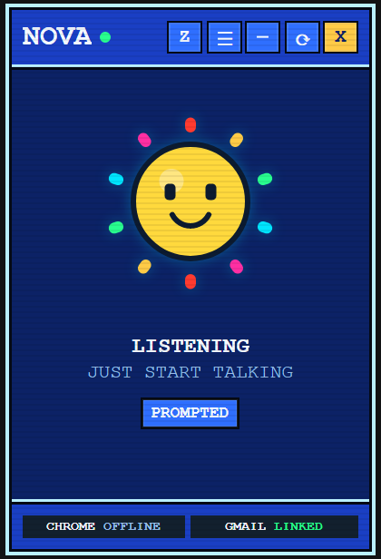
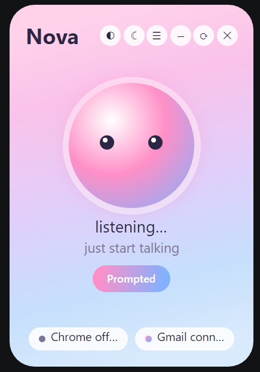
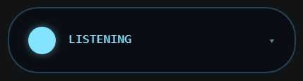
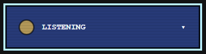
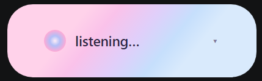
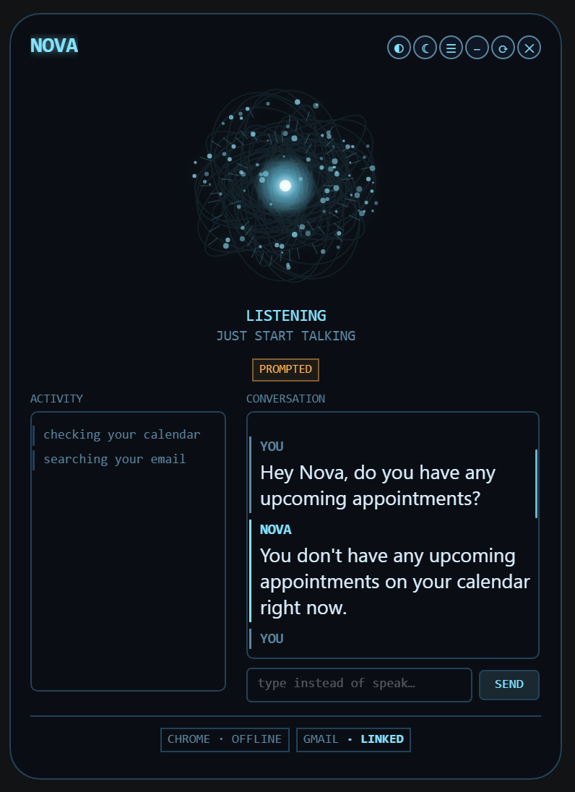
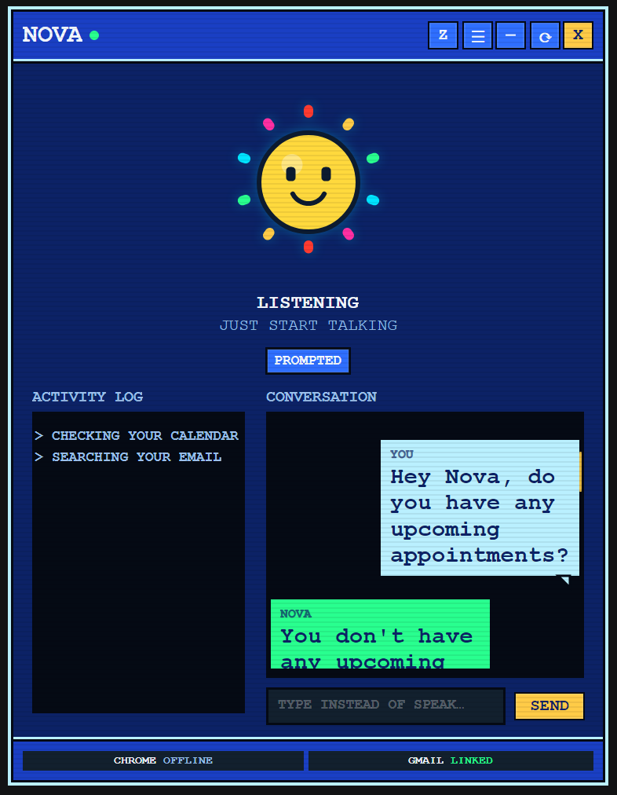
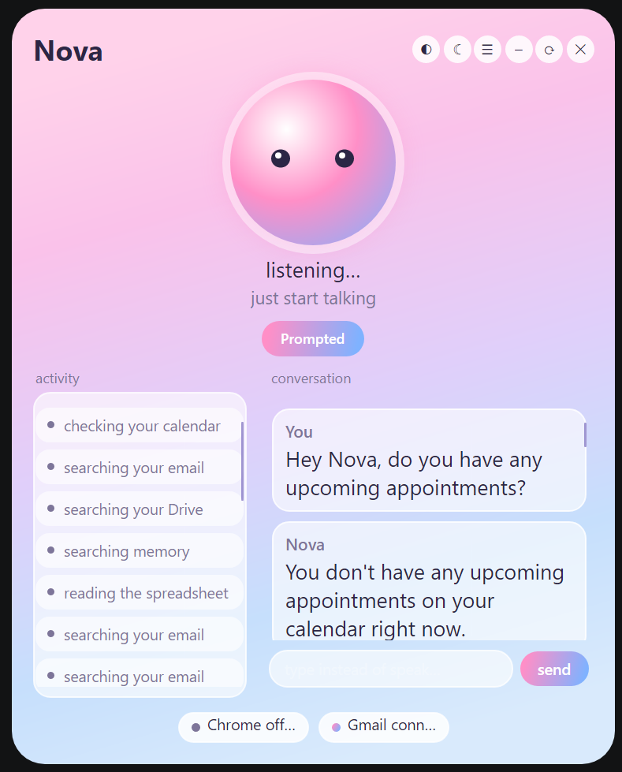

# Nova - In Progress

Nova is a voice-first desktop assistant for Windows, built on Claude. The idea started with E.V. from *Spider-Man: Brand New Day* — an AI that doesn't just answer when spoken to, but notices what you're doing and offers to help. I wanted to see how much of that was actually buildable with what's available today, not just as a chatbot with a microphone bolted on, but something that watches your screen, acts on real apps, evolves over time and remembers you from one session to the next.

You talk to it, it talks back — fully local speech-to-text and text-to-speech, so nothing you say leaves your machine unless a task actually needs the internet. It reads native apps and the browser through Windows UI Automation and Playwright rather than screenshots, so it's reading structured data, not guessing from pixels. It keeps a real memory across restarts (and gets smarter about *how* it remembers things, not just that it does). And it can write, compile, and run its own small tools at runtime when it hits something it doesn't have a tool for yet, with a self-repair loop if one of those tools starts misbehaving.

### A few things I'm actually proud of

**The permission model.** My first pass at "ask before doing anything risky" ended up asking three separate times for one task — can I read this, can I edit this, can I send this — which felt like filling out a form, not talking to an assistant. It's down to two checkpoints now: one spoken authorization that only fires when Nova brings something up on her own (not when you directly ask for it — you already gave permission by asking), and one stricter, click-only popup review that fires for anything genuinely irreversible, no matter how the task started. A direct request like "fix the typos in this email and send it" now runs with zero interruption right up until the actual send, where you get one real look at what's about to go out.

**Self-repair.** Every tool Nova builds for herself lives in its own isolated, git-versioned project — never touching her own core logic. If one starts failing three times in a row on the same task, she automatically reverts it to the last version that worked, rebuilds it, and just mentions it in passing rather than making a whole announcement out of it.

**No wake word, one hotkey.** Earlier versions had a whole ladder of "comfort levels" you'd switch between by voice, including a fully-ambient always-listening mode. I scrapped it — that's exactly the kind of unsolicited-interruption behavior people hated about Clippy. Now there's just awake and asleep, and the only way to wake her back up is a hotkey, never a spoken word she might mishear out of context.

Full write-up of how all this fits together: [docs/ARCHITECTURE.md](docs/ARCHITECTURE.md). Things I tried and specifically didn't do, and why: [docs/DESIGN_DECISIONS.md](docs/DESIGN_DECISIONS.md).

## Tools and strategy

Nova's built-in **tools** cover the ground you'd expect a screen/browser-aware assistant to cover:

- **Files** — read, list, edit (with full undo history via `revert_file_edit`), delete
- **Shell and desktop** — run terminal commands, launch/open paths, read the screen via UI Automation, click/type/scroll into native apps, watch a terminal window for build/test output worth mentioning
- **Browser** — navigate, read the page, fill/select/check form fields, upload files, click (restricted to navigational actions only — see the permission model below)
- **Memory** — save and search durable facts about you, search past conversations
- **Google Workspace** (optional) — Gmail, Calendar, Docs, Drive, Sheets, Slides
- **Self-building** — write, compile, and run her own new tools at runtime for a capability she doesn't already have (see "Self-repair" above)
- **Diagnostics** — recent error log, runtime settings

Beyond calling tools, Nova also learns *how* to approach a task, not just facts about you. This is **strategy** — the project's own name for a small case-based reasoning (CBR) system: at the start of a task, `StrategyRouter` checks whether a previously-saved approach applies, using an LLM judgment call rather than embedding similarity alone, since a genuinely general lesson ("pull broad instead of guessing narrow keywords") often shares no vocabulary with a new, differently-worded task it should still apply to. At the end, `StrategyReflection` judges whether the approach actually taken was efficient, and reinforces a strategy that's still pulling its weight, saves a new one when a strategy-free task went well, or reworks one after three underperforming uses in a row — a case-based memory of *approaches*, updated the same way it's retrieved: by outcome, not just by recall.

## The Overlay

Nova runs as a small floating overlay rather than a console window, with three interchangeable skins — same live state (listening, speaking, asleep, what she's currently doing), three completely different looks. Cycle between them anytime with the switcher button.

| ARC | WEB | AURA |
|---|---|---|
|  |  |  |
| Hologram-globe HUD, cyan theme | Retro pixel-art tracker | Soft pastel companion |

Each skin also has three sizes, same state carried across all of them:

| | ARC | WEB | AURA |
|---|---|---|---|
| **Pill** — collapsed, just enough to see she's listening |  |  |  |
| **Minimized** — current activity, comfort-level toggle |  |  |  |
| **Maximized** — full conversation transcript alongside a running activity log |  |  |  |

A single click collapses straight back down to the pill from either size.

## What's next
- Local LLM support, as an alternative to the Claude API — mostly a cost question rather than a time one; the reasoning core needs a model genuinely capable of long agentic tool-use loops, and the local options at that bar are still heavier/pricier (hardware-wise) than paying per-call
- Full UI customization — position, theming, layout, beyond just the three built-in skins
- Figma and Blender integrations, built the same way as any other self-contained tool, driving each app's own scripting API rather than generating content from scratch
- Proactive inbox push-watching instead of polling
- 3D-printable model generation for parametric shapes (brackets, mounts, enclosures) via OpenSCAD
- A thin phone client eventually, with the PC doing all the actual reasoning

## Dependencies

Windows only — it leans on Windows UI Automation and native `cmd.exe` integration. You'll need the [.NET 10 SDK](https://dotnet.microsoft.com/download) and an [Anthropic API key](https://console.anthropic.com/); everything else below is a NuGet package pulled in automatically on first build, nothing to install by hand.

- **Reasoning**: the official [`Anthropic`](https://www.nuget.org/packages/Anthropic) C# SDK (Claude Sonnet 5 + Haiku 4.5)
- **Voice**: [Whisper.net](https://www.nuget.org/packages/Whisper.net) (speech-to-text, default) or [sherpa-onnx](https://github.com/k2-fsa/sherpa-onnx) (an experimental streaming alternative — see `docs/DESIGN_DECISIONS.md`), [KokoroSharp](https://www.nuget.org/packages/KokoroSharp.CPU) (text-to-speech), and [SoundFlow's WebRTC Audio Processing Module](https://www.nuget.org/packages/SoundFlow.Extensions.WebRtc.Apm) (real acoustic echo cancellation, so Nova doesn't hear herself)
- **Screen/browser reading**: [FlaUI](https://www.nuget.org/packages/FlaUI.Core) (Windows UI Automation) and [Microsoft.Playwright](https://www.nuget.org/packages/Microsoft.Playwright) (browser DOM access)
- **Overlay UI**: [Avalonia](https://www.nuget.org/packages/Avalonia) (the floating HUD, all three skins)
- **Memory**: [Microsoft.Data.Sqlite](https://www.nuget.org/packages/Microsoft.Data.Sqlite) + [ElBruno.LocalEmbeddings](https://www.nuget.org/packages/ElBruno.LocalEmbeddings) (local embeddings for semantic memory search)
- **Google Workspace** (optional): the `Google.Apis.*` client libraries for Gmail, Calendar, Docs, Drive, Sheets, and Slides

## Getting started

```
git clone https://github.com/wasmiester/NOVA.git
cd NOVA
cp secrets/.env.example secrets/.env
# edit secrets/.env and set ANTHROPIC_API_KEY
dotnet run
```

First run downloads about 400MB of local models (Whisper for speech-to-text, Silero for voice-activity-detection, Kokoro for text-to-speech) — after that, everything runs offline.

## Limitations
Gmail, Calendar, Docs, Drive, Sheets, and Slides are optional and can be connected later from the in-app credentials popup, but each one is a **separate API that has to be individually enabled** in your Google Cloud project (APIs & Services > Enabled APIs & services), not just one "Google" toggle:

- Gmail API
- Google Calendar API
- Google Docs API
- Google Drive API
- Google Sheets API
- Google Slides API

Enable all six up front if you're planning to use any of them — a disabled API fails at call time (a 403 partway through a task), not at startup, and it can take a few minutes after enabling before it actually takes effect. Full setup steps (OAuth consent screen, credentials) are in `secrets/.env.example`.

**Browser automation only works with Chrome**, and only through a separate, dedicated Chrome instance Nova launches and controls herself — never your regular, already-running Chrome window. Chrome 136+ silently ignores the remote-debugging flag on your default profile for security reasons, so a separate instance is the only way this can work at all. Practically, that means she can't see or act on tabs already open in your normal browsing session, and any logins/extensions live in that separate profile, not your main one Worth knowing too: while that instance is running, its debug port (`localhost:9222`) is a real local control surface — anything else on the machine able to reach it has full read/control access to that browser window.
